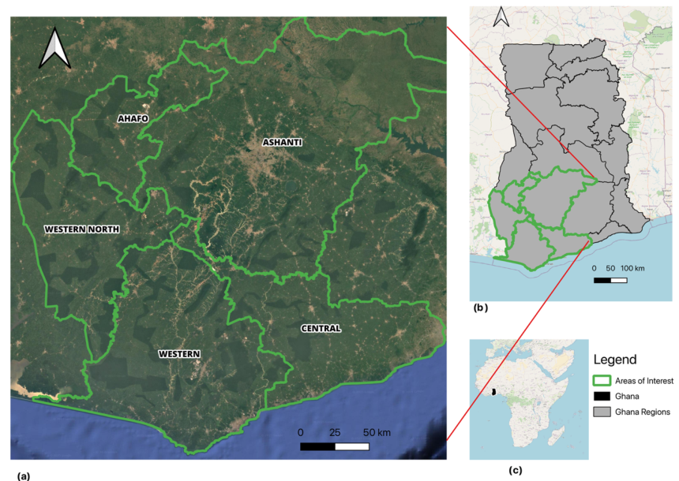
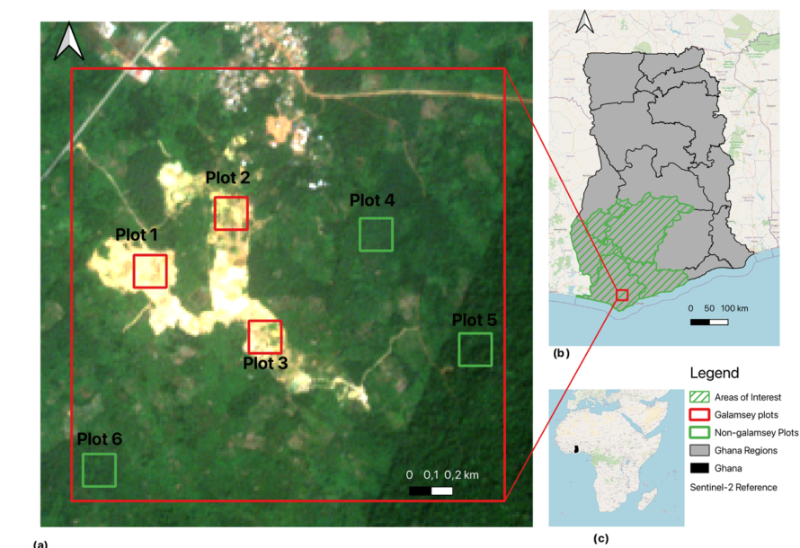
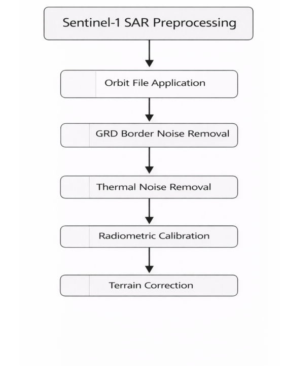
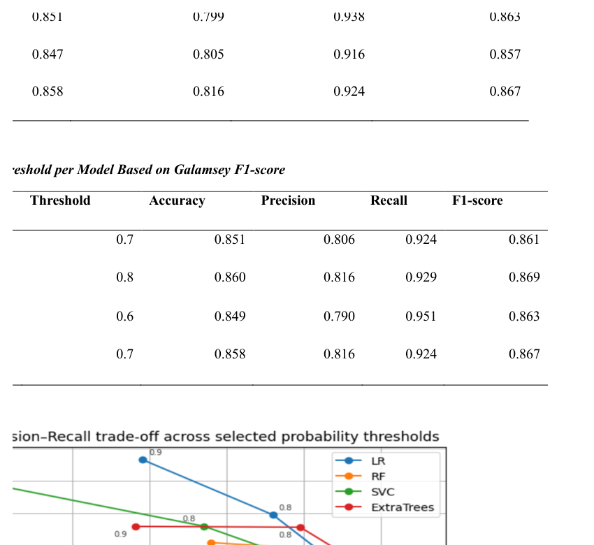
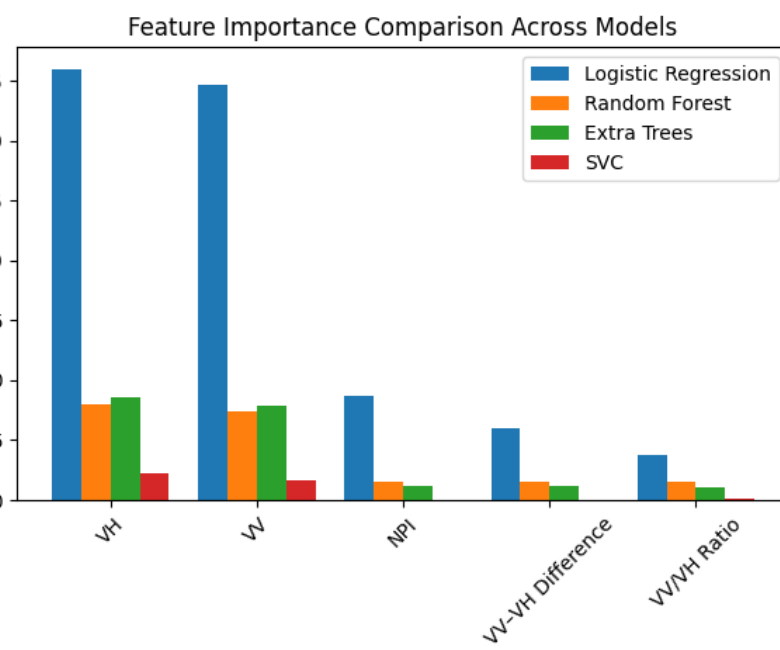
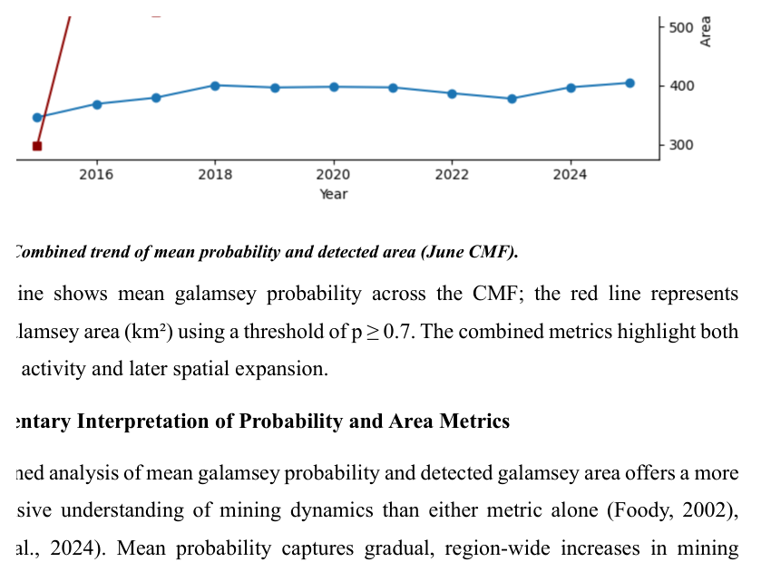
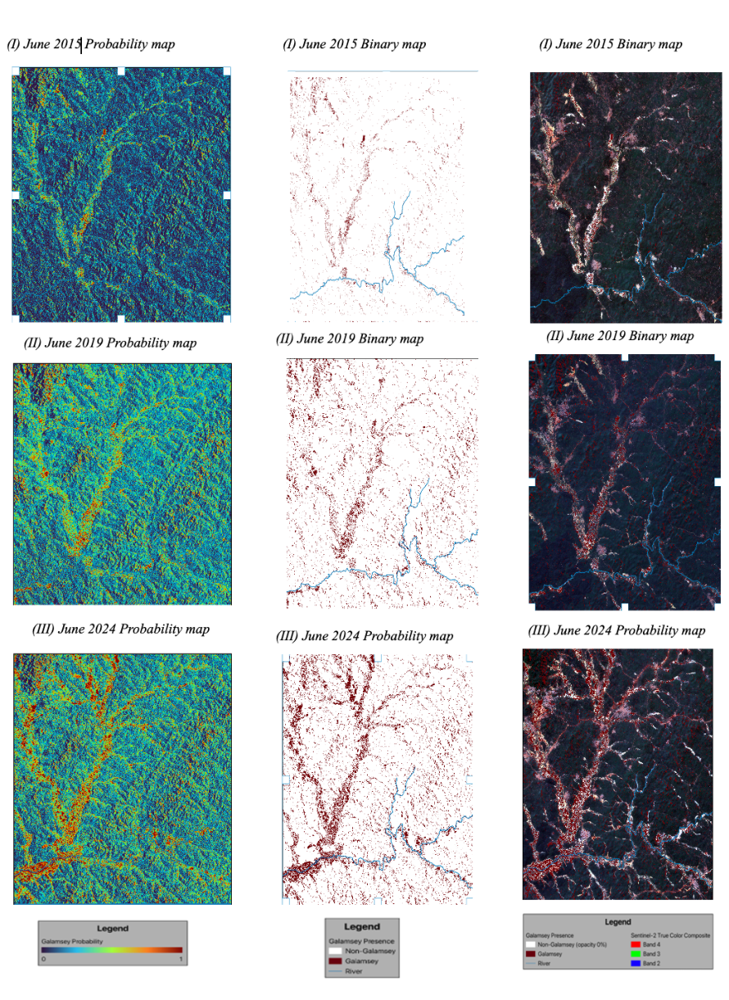
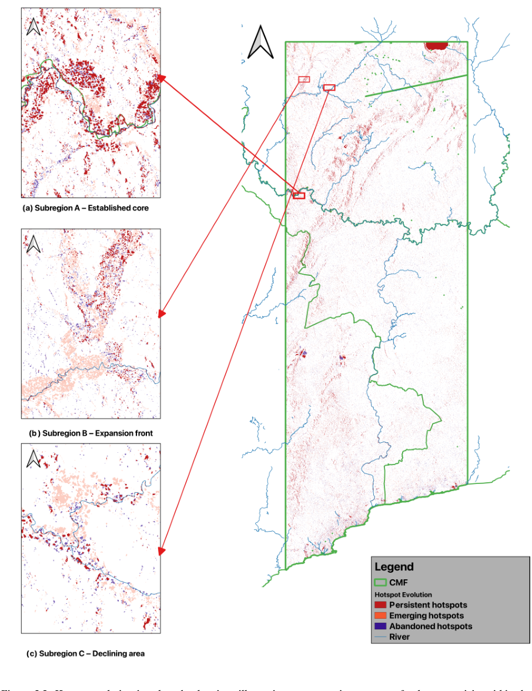

# Sentinel-1 SAR Monitoring of Galamsey Activity in Southern Ghana

**Geospatial Portfolio Project | Remote Sensing | GIS | Synthetic Aperture Radar (SAR) | Machine Learning | Python**

A thesis-derived geospatial research project investigating the use of **Copernicus Sentinel-1 C-band Synthetic Aperture Radar (SAR)** time-series data and supervised machine learning to support the detection and temporal monitoring of artisanal and small-scale gold-mining activity (*galamsey*) in Southern Ghana.

> **Portfolio scope:** This repository is a technical and reproducibility component of my MSc Forest Information Technology research. It presents a SAR-based monitoring framework and research workflow; it is **not presented as a deployed real-time operational monitoring service**.

---

## Project at a Glance

| | |
|---|---|
| **Study area** | Ashanti, Ahafo, Central, Western and Western North, Ghana |
| **Primary data** | Copernicus Sentinel-1 GRD C-band SAR |
| **Reference data** | Sentinel-2 imagery and labelled reference samples |
| **Sentinel-1 scenes** | 1,748 scenes covering 2015–2025 |
| **Labelled samples** | 1,425 samples: 720 galamsey and 705 non-galamsey |
| **SAR features** | VV, VH, VV–VH difference, VV/VH ratio, NPI |
| **Machine learning** | Logistic Regression, Random Forest, SVC, ExtraTrees |
| **Spatial validation** | Plot-based separation and GroupKFold |
| **Monitoring period** | 2015–2025 |
| **Common Monitoring Footprint** | June acquisitions, 2015–2025 |
| **Operational threshold used in temporal monitoring** | P(galamsey) ≥ 0.70 |
| **Main tools** | Python, ESA SNAP, Google Earth Engine, QGIS, Copernicus Data Space Ecosystem |

---

## Project Overview

Artisanal and small-scale gold mining can produce rapid changes in land cover and surface conditions. In tropical environments, optical satellite imagery can also be constrained by persistent cloud cover.

This project investigates whether **Sentinel-1 SAR time-series information** can provide a complementary source of evidence for detecting and monitoring mining-related activity.

The overall workflow combines:

**Satellite data acquisition → SAR preprocessing → reference-data generation → feature engineering → machine learning → spatial prediction → probability/binary outputs → temporal monitoring → hotspot evolution**


---

## Research Question

> **Can Sentinel-1 SAR time-series information support timely detection and monitoring of galamsey activity in Southern Ghana?**

---

## Objectives

The research was designed to:

1. Process Sentinel-1 SAR imagery into analysis-ready backscatter data.
2. Engineer SAR-derived predictors for galamsey classification.
3. Train and compare supervised machine-learning classifiers.
4. Reduce the risk of spatial leakage through plot-based data separation and grouped cross-validation.
5. Generate probability and binary detection outputs.
6. Restrict temporal analysis to a Common Monitoring Footprint (CMF) for spatial consistency.
7. Analyse annual detection patterns and the spatial persistence/evolution of hotspots from 2015 to 2025.

---

# Study Area

The study focused on mining-affected areas across five regions of Southern Ghana:

- **Ashanti**
- **Ahafo**
- **Central**
- **Western**
- **Western North**



The study-area definition follows the thesis research design and represents the primary area of interest for the monitoring workflow.

---

# Data

## Sentinel-1 SAR

The primary analytical dataset consists of **Sentinel-1 Ground Range Detected (GRD) C-band SAR** observations using VV and VH polarisation information.

The thesis workflow used **1,748 Sentinel-1 scenes spanning 2015–2025**.

Sentinel-1 was selected because SAR observations can provide repeated measurements independent of daylight and largely independent of cloud cover, making them useful for monitoring land-surface disturbance.

## Sentinel-2 Reference Information

Sentinel-2 imagery was used as **reference information for identifying and labelling samples**.

The Sentinel-2 spectral bands were not used as predictors in the machine-learning feature set.

The labelled reference dataset contains:

- **1,425 labelled samples**
- **720 galamsey samples**
- **705 non-galamsey samples**
- Six reference plots



---

# Methodology

## 1. Sentinel-1 SAR Preprocessing

Sentinel-1 GRD scenes were processed using **ESA SNAP** and Python.

The supplied batch-processing workflow includes:

1. Apply Orbit File
2. Remove GRD Border Noise
3. Thermal Noise Removal
4. Radiometric Calibration to Sigma0 for VV/VH
5. Terrain Correction using SRTM
6. Conversion to decibel (dB)
7. GeoTIFF/BigTIFF export



### Implementation note

The supplied single-scene and batch preprocessing scripts are not completely identical. In particular, the batch script includes **GRD border-noise removal**, whereas the supplied single-scene script does not. The repository documents this difference rather than silently changing the original research implementation.

The supplied scripts also use different Python SNAP bridge import names (`snappy` and `esa_snappy`), reflecting the supplied code/environment setup.

---

## 2. Reference Data and Sample Preparation

Reference information was used to identify galamsey and non-galamsey observations across the study area.

The machine-learning dataset contains Sentinel-1-derived predictors associated with labelled reference observations.

---

## 3. Feature Engineering

Five Sentinel-1-derived predictors are used by the supplied model-training workflow:

| Feature | Description |
|---|---|
| **VV** | VV backscatter in dB |
| **VH** | VH backscatter in dB |
| **VV–VH difference** | Difference between VV and VH backscatter |
| **VV/VH ratio** | Ratio calculated after conversion from dB to linear scale |
| **NPI** | Normalized Polarisation Index calculated from linear VV and VH |

The model-training workflow converts the dB VV/VH values to linear scale where required for the ratio and NPI calculations.

Invalid/infinite derived values are handled before model fitting, with median imputation included within the supplied model pipelines.

---

# Machine Learning

Four supervised classifiers were trained and compared:

- **Logistic Regression (LR)**
- **Random Forest (RF)**
- **Support Vector Classifier (SVC)**
- **ExtraTrees (ET)**

The supplied training workflow uses scikit-learn pipelines and performs hyperparameter optimisation using `RandomizedSearchCV` with grouped cross-validation.

## Spatially grouped validation

Spatial dependence is an important consideration when working with remotely sensed pixels. Nearby observations can share similar environmental and SAR characteristics.

The supplied workflow therefore separates observations by **reference plot** rather than treating every pixel as an independent random observation.

The thesis workflow uses:

- **Plots 2, 3, 4 and 6** for model development
- **Plots 1 and 5** as spatially independent held-out plots

`GroupKFold` is used during model tuning.

> **Implementation note:** The current training script creates the held-out test split but does not calculate held-out test metrics. Therefore, this repository does not claim held-out test performance from that script.

---

# Model Results

The thesis reports the following classification performance for the galamsey class:

| Model | Accuracy | Precision | Recall | F1-score |
|---|---:|---:|---:|---:|
| Logistic Regression | 0.84 | 0.77 | 0.96 | 0.86 |
| Random Forest | 0.83 | 0.76 | 0.96 | 0.85 |
| SVC | 0.82 | 0.75 | 0.96 | 0.85 |
| ExtraTrees | 0.84 | 0.77 | 0.96 | 0.85 |

The values above correspond to the thesis' reported classification-performance summary.

---

# Probability-Based Detection

The monitoring workflow uses model probability outputs as a continuous measure of predicted galamsey occurrence.

For quantitative spatial analysis, the probability outputs are converted into binary classifications using a fixed threshold.

### Operational threshold

**P(galamsey) ≥ 0.70**

Pixels meeting or exceeding the threshold are classified as galamsey (`1`), while pixels below the threshold are classified as non-galamsey (`0`).



The thesis also evaluates model performance across different probability thresholds and reports the best threshold for each model based on galamsey F1-score.

| Model | Best threshold | Accuracy | Precision | Recall | F1-score |
|---|---:|---:|---:|---:|---:|
| Logistic Regression | 0.7 | 0.851 | 0.806 | 0.924 | 0.861 |
| Random Forest | 0.8 | 0.860 | 0.816 | 0.929 | 0.869 |
| SVC | 0.6 | 0.849 | 0.790 | 0.951 | 0.863 |
| ExtraTrees | 0.7 | 0.858 | 0.816 | 0.924 | 0.867 |

The **0.70 threshold** is the threshold used for the operational monitoring workflow described in the thesis.

---

# Feature Importance

The thesis compares feature-importance values across the four models.



Reported feature-importance values include:

| Feature | LR | RF | ExtraTrees | SVC |
|---|---:|---:|---:|---:|
| VH | 1.80 | 0.40 | 0.43 | 0.11 |
| VV | 1.74 | 0.37 | 0.39 | 0.08 |
| NPI | 0.43 | 0.08 | 0.06 | 0.00 |
| VV–VH Difference | 0.30 | 0.08 | 0.06 | 0.00 |
| VV/VH Ratio | 0.19 | 0.08 | 0.06 | 0.01 |

These values are reported from the thesis' feature-importance comparison.

---

# Temporal Monitoring

## Common Monitoring Footprint (CMF)

Temporal monitoring requires spatially consistent coverage so that changes between years are not caused simply by differences in satellite acquisition footprints.

The thesis therefore defines a **Common Monitoring Footprint (CMF)** as the spatial intersection of Sentinel-1 acquisitions for **June across 2015–2025**.

A binary spatial mask was created by retaining pixels with valid data across all years.

All subsequent temporal monitoring outputs were restricted to this common footprint.

### Why June?

The thesis selected June because:

- it falls within Ghana's major dry season in the forest zone;
- it generally provides lower cloud-related constraints for complementary optical reference information;
- Sentinel-1 acquisition coverage was sufficiently consistent across the study period;
- using the same month supports year-to-year spatial comparison.

The CMF therefore provides a consistent spatial basis for the annual temporal analysis.

---

## Probability and Binary Outputs

The monitoring framework generates:

### Probability maps

Each pixel contains a continuous predicted probability of galamsey occurrence between 0 and 1.

### Binary classification maps

The probability maps are converted to binary outputs using the 0.70 threshold:

```text
P(galamsey) ≥ 0.70  →  Galamsey (1)
P(galamsey) < 0.70  →  Non-galamsey (0)
```

The thesis workflow describes prediction outputs at the acquisition/scene level, aggregation into monthly composites, and subsequent annual analysis within the CMF.





---

# Temporal Results: 2015–2025

The thesis reports the following annual values within the June Common Monitoring Footprint:

| Year | Mean galamsey probability | Detected galamsey area (km²) |
|---|---:|---:|
| 2015 | 0.140 | 298.1 |
| 2016 | 0.185 | 695.0 |
| 2017 | 0.205 | 524.8 |
| 2018 | 0.247 | 723.7 |
| 2019 | 0.239 | 607.7 |
| 2020 | 0.241 | 638.2 |
| 2021 | 0.240 | 648.8 |
| 2022 | 0.220 | 610.9 |
| 2023 | 0.202 | 548.1 |
| 2024 | 0.240 | 761.1 |
| 2025 | 0.255 | 755.7 |


The temporal analysis provides both:

- a continuous probability-based indicator; and
- a threshold-based detected-area measure.

These measures should be interpreted as outputs of the research classification workflow rather than direct measurements of mining activity on the ground.

---

# Hotspot Evolution

Annual binary classifications were used to characterise different patterns of spatial behaviour across the 2015–2025 period.

The supplied hotspot-evolution analysis defines:

| Hotspot category | Definition |
|---|---|
| **Persistent** | Active in at least 8 of 11 years |
| **Emerging** | No activity during 2015–2019 and active in at least 2 years during 2020–2025 |
| **Abandoned** | Active in at least 2 years during 2015–2019 and no activity during 2022–2025 |

The combined hotspot raster uses:

```text
0 = No hotspot
1 = Persistent
2 = Emerging
3 = Abandoned
```



This analysis converts the annual classification stack into a simple spatial representation of persistence and change.

---

# Technologies & Skills Demonstrated

## GIS & Geospatial Analysis

- Raster data processing
- Spatial data management
- Temporal raster analysis
- Common Monitoring Footprint analysis
- Spatially grouped validation
- Hotspot mapping and classification
- QGIS

## Remote Sensing

- Sentinel-1 SAR
- Sentinel-2 reference imagery
- VV/VH polarisation analysis
- SAR preprocessing
- Terrain correction
- Backscatter analysis
- Temporal monitoring
- Change and hotspot analysis

## Programming & Data Science

- Python
- NumPy
- pandas
- scikit-learn
- rasterio
- Feature engineering
- Machine-learning pipelines
- Hyperparameter optimisation
- Raster-based analysis

## Remote-Sensing Platforms & Software

- ESA SNAP
- Google Earth Engine
- Copernicus Data Space Ecosystem
- QGIS

---

# Repository Structure

```text
galamsey_sar_monitoring/
│
├── README.md
├── LICENSE
├── CITATION.cff
├── requirements.txt
├── .gitignore
│
├── data/
│   └── README.md
│
├── docs/
│   └── methodology.md
│
├── figures/
│   ├── study_area.png
│   ├── workflow.png
│   ├── preprocessing_workflow.png
│   ├── reference_plots.png
│   ├── feature_importance.png
│   ├── threshold_analysis.png
│   ├── temporal_analysis.png
│   ├── temporal_outputs.png
│   └── hotspot_evolution.png
│
├── notebooks/
│   └── README.md
│
├── results/
│   └── README.md
│
└── scripts/
    ├── download_s1_cdse_s3.py
    ├── s1_snap_preprocess.py
    ├── s1_snap_batch_preprocess.py
    ├── train_s1_models.py
    └── hotspot_evolution.py
```

---

# Reproducibility

## Sentinel-1 Data Access

The download workflow uses the **Copernicus Data Space Ecosystem**.

Credentials are supplied through environment variables and should never be committed to GitHub.

```bash
export CDSE_USERNAME="your_username"
export CDSE_PASSWORD="your_password"
```

## SNAP Processing

The preprocessing scripts require an installed **ESA SNAP** environment and compatible Python SNAP bindings.

SNAP is an external dependency and is therefore not installed through the standard Python requirements file alone.

## Machine Learning

The training script expects labelled Sentinel-1 feature data containing the required class, plot and SAR feature fields.

The workflow performs:

1. Feature engineering
2. Data cleaning
3. Grouped cross-validation
4. Hyperparameter optimisation
5. Model training
6. Model serialisation

## Large Data

Raw Sentinel-1 products, large GeoTIFF outputs and trained model artefacts are not included in the repository.

This keeps the repository focused on the **code, methodology, figures and documented results** rather than duplicating large satellite datasets.

---

# Research Limitations

Several limitations are important when interpreting this project:

- This repository represents a **research monitoring framework**, not a production monitoring service.
- The supplied single-scene and batch preprocessing scripts do not implement completely identical preprocessing chains.
- The current model-training script creates a held-out test split but does not calculate held-out test metrics.
- Large satellite datasets and trained model artefacts are not included.
- Hotspot categories depend on the temporal thresholds defined in the supplied hotspot-analysis script.
- The thesis identifies spatial-generalisation limitations, with performance varying between spatially independent test plots.
- Detected area and probability outputs represent model-derived classifications and should not be interpreted as direct ground measurements of mining activity.

These limitations are documented deliberately so that the portfolio is transparent about what the research workflow demonstrates and what it does not.

---

# Project Context

This project was developed as part of my **MSc Forest Information Technology (FIT)** research at the **Eberswalde University for Sustainable Development (HNEE)**.

The associated research investigated the development of a timely monitoring approach for detecting galamsey activity using **Copernicus Sentinel-1 C-band SAR time-series data** in Southern Ghana.

---

# Author

**Anabel Bonsu**

MSc Forest Information Technology  
Eberswalde University for Sustainable Development (HNEE)

---

# Citation

If you use or build upon this project, please refer to [`CITATION.cff`](CITATION.cff) for citation information.

---

## Portfolio Takeaway

This project demonstrates an end-to-end geospatial workflow:

**Satellite data acquisition → SAR preprocessing → feature engineering → spatially aware machine learning → probability-based detection → temporal monitoring → hotspot evolution**

It brings together practical experience across:

**GIS · Remote Sensing · SAR · Python · Raster Analysis · Machine Learning · Environmental Monitoring**
