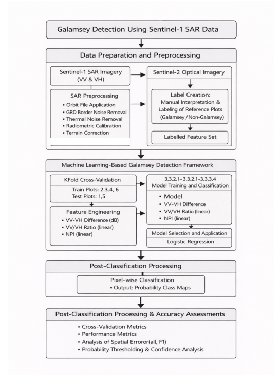

# Model Performance

## Overview

Four supervised classifiers were evaluated for the galamsey class using Sentinel-1-derived predictors: Logistic Regression (LR), Random Forest (RF), Support Vector Classifier (SVC), and ExtraTrees (ET).

## Classification performance

| Model | Accuracy | Precision | Recall | F1-score |
|---|---:|---:|---:|---:|
| Logistic Regression | 0.84 | 0.77 | 0.96 | 0.86 |
| Random Forest | 0.83 | 0.76 | 0.96 | 0.85 |
| SVC | 0.82 | 0.75 | 0.96 | 0.85 |
| ExtraTrees | 0.84 | 0.77 | 0.96 | 0.85 |

These are the thesis-reported classification-performance results for the galamsey class.

## Spatial validation

The workflow separated observations by reference plot and used `GroupKFold` during model tuning. The thesis workflow used plots 2, 3, 4 and 6 for model development and plots 1 and 5 as spatially independent held-out plots.

A key limitation reported by the thesis is that all four models showed a major failure pattern on spatially independent Plot 5, where galamsey recall dropped to zero. This demonstrates why aggregate accuracy and F1-score should be interpreted together with spatial generalisation.

## Related figure

## Implementation note

The supplied training script creates a held-out test split but does not calculate held-out test metrics. The values above are therefore documented as thesis-reported results, not as results freshly generated by executing the current script.
